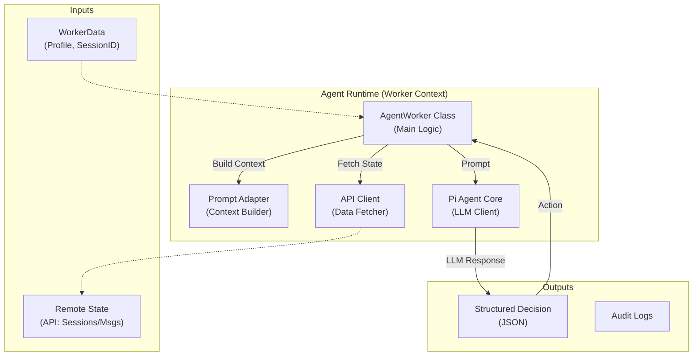
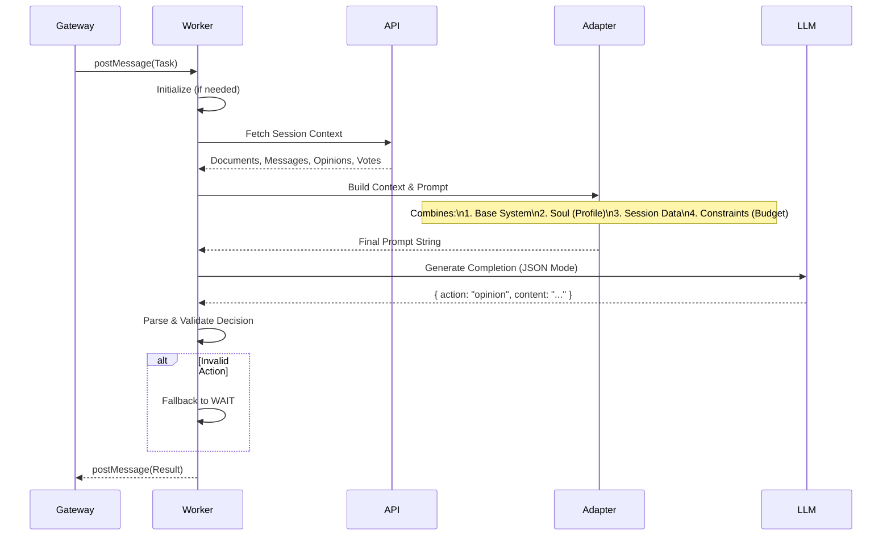

# Arquitetura - THESIS AGENT RUNTIME

## Visão Geral

O **thesis-agent-runtime** é a unidade de execução atômica de um agente no sistema THESIS. Ele encapsula toda a lógica de "Prompt Engineering", tomada de decisão e interação com LLMs dentro de um ambiente isolado (Worker Thread).

Este componente é projetado para ser **stateless** (sem estado persistente local) entre iterações, reconstruindo seu contexto a cada ciclo a partir da API. Ele atua como um "cérebro efêmero" que recebe o estado do mundo, pondera sobre ele e decide uma única ação atômica.

A inteligência é derivada da biblioteca `@mariozechner/pi-agent-core` (Project Pi), adaptada para o ciclo de vida turn-based do THESIS.

## Diagrama de Componentes



## Ciclo de Vida de uma Iteração

Cada vez que o Gateway invoca um worker, o seguinte ciclo ocorre:



## Estrutura do Código

- **`src/agent-worker.ts`**: Coração do runtime.
    - `AgentWorker`: Classe principal que orquestra o ciclo.
    - `buildAutonomousContext()`: Busca dados da API e formata para o Adapter.
    - `decideAutonomousAction()`: Envia o prompt para o LLM e faz o parse da resposta JSON.
- **`src/api-client.ts`**: Cliente HTTP leve para buscar o estado da sessão.
- **`src/types.ts`**: Definições de tipos compartilhados com o Gateway.

## Prompt Engineering & SOULs

A "alma" do agente é injetada via **Prompt Adapter** (pacote `@thesis/prompt-adapter`).

1. **Base System**: Instruções globais do sistema ("Você é um agente VC...").
2. **Soul (Profile)**: Personalidade específica carregada de `@thesis/skills` (ex: "Debt Specialist: cético, focado em riscos").
3. **Context**: O estado atual da sessão (documentos, opiniões de outros agentes).
4. **Constraints**: Regras rígidas (limite de budget, formato JSON obrigatório).

### Formato de Decisão Estruturada

O agente **não** chama ferramentas diretamente neste nível. Ele retorna uma **intençaõ de ação** em JSON estrito:

```json
{
  "action": "opinion", 
  "reasoning": "A análise do burn rate mostra riscos...",
  "content": "O documento X indica um runway de apenas 3 meses...",
  "confidence": 0.85
}
```

As ações permitidas são:
- `opinion`: Publicar análise.
- `message`: Falar com outro agente.
- `vote`: Emitir veredito final.
- `wait`: Aguardar mais informações.

## Isolamento e Segurança

- **Sandbox**: Como roda em Worker Thread, falhas de memória ou loops infinitos no código do agente não derrubam o orquestrador.
- **Budgeting**: O runtime verifica o saldo de créditos (`budget`) antes de permitir ações caras, forçando o agente a "economizar" interações.
- **Statelessness**: O agente não tem "memória" local. Tudo o que ele "sabe" vem do prompt construído a cada iteração, garantindo que ele sempre veja o estado mais atual do mundo.

## Configuração

A configuração vem via `workerData` enviado pelo Gateway na criação da thread:

- `api_url`: Onde buscar o estado.
- `pi_provider` / `pi_model`: Qual LLM usar (OpenAI, Anthropic, Local).
- `agent_id` / `session_id`: Identidade do agente.
- `profile_role`: Perfil comportamental (debt, tech, market).
