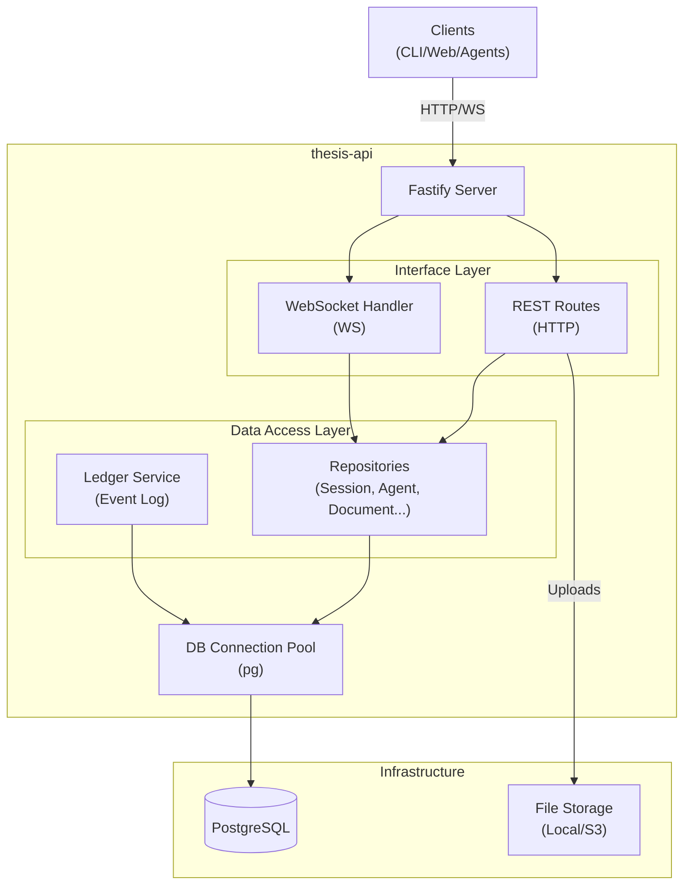
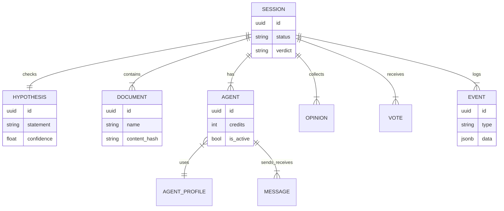

# Arquitetura - THESIS API

## Visão Geral

A **thesis-api** é o coração do sistema THESIS. Ela atua como a fonte de verdade (Source of Truth) para todo o estado das análises, gerenciando a persistência de dados, a coordenação em tempo real via WebSockets e fornecendo uma interface HTTP REST para clientes (CLI, Frontend) e agentes.

Construída sobre **Fastify**, a API é desenhada para ser performática e modular, utilizando uma arquitetura em camadas (Router -> Service/Repository -> Database).

## Diagrama de Componentes

## Modelo de Dados (Schema)

O banco de dados PostgreSQL é estruturado para suportar o ciclo de vida da sessão de análise e o padrão de Event Sourcing simplificado (Ledger).

## Estrutura do Código

A organização do código segue o padrão de "Feature-based" misturado com "Layer-based":

- **`src/index.ts`**: Configuração central do Fastify, registro de plugins (CORS, Multipart, WebSocket) e injeção de dependências (Repositórios).
- **`src/routes/`**: Definição dos endpoints REST. Cada arquivo agrupa rotas de um recurso (ex: `sessions.ts`, `agents.ts`).
- **`src/repositories/`**: Camada de acesso a dados. Encapsula queries SQL usando `pg`. Não há ORM complexo, apenas SQL direto para performance e controle.
- **`src/websocket/`**: Handler para conexões WebSocket. Gerencia o broadcast de eventos para clientes conectados (ex: War Room atualizando em tempo real).
- **`src/db/`**: Configuração de conexão e schema do banco.

## Fluxos Principais

### 1. Ledger de Eventos (Auditabilidade)

Toda operação de escrita crítica no sistema (criar sessão, postar opinião, votar) gera um registro na tabela `events`. Isso permite reconstruir a história de uma análise.

1. Cliente chama `POST /sessions/:id/opinions`.
2. `OpinionRepository` insere a opinião na tabela `opinions`.
3. `LedgerRepository` insere um evento `opinion.posted` na tabela `events`.
4. `WebSocketHandler` notifica todos os ouvintes sobre o novo evento.

### 2. Comunicação em Tempo Real

O WebSocket é usado primariamente para **Broadcast** de mudanças de estado.

- **Conexão**: `/ws/sessions/:id`
- **Mensagens**: O servidor envia JSONs com `{ type: "EVENT_TYPE", data: ... }`.
- **Uso**: O Frontend (War Room) usa isso para atualizar a UI sem polling. O Gateway de Agentes usa para saber quando novos documentos ou mensagens chegaram.

### 3. Sistema de Créditos (Budget)

Para evitar loops infinitos e custos excessivos de LLM, cada Agente possui um orçamento (`budget_credits`).

- Cada mensagem enviada consome créditos.
- A API verifica o saldo antes de permitir o envio (`MessageRepository`).
- Se o saldo acabar, o agente não pode mais interagir até que (opcionalmente) receba recarga.

## Endpoints Chave

| Método | Caminho | Descrição |
|--------|---------|-----------|
| `POST` | `/sessions` | Cria nova sessão e hipótese |
| `POST` | `/sessions/:id/documents` | Upload de arquivo (multipart) |
| `POST` | `/sessions/:id/agents` | Adiciona um agente à sessão |
| `POST` | `/sessions/:id/opinions` | Publica uma opinião de agente |
| `GET`  | `/sessions/:id/report` | Gera JSON com resumo completo |
| `WS`   | `/ws/sessions/:id` | Stream de eventos da sessão |

## Configuração

| Variável | Padrão | Descrição |
|----------|--------|-----------|
| `PORT` | `4000` | Porta HTTP |
| `DATABASE_URL` | - | Connection string PostgreSQL |
| `CORS_ORIGIN` | `true` | Configuração de CORS |

## Detalhes de Implementação

### Upload de Arquivos
Utiliza `@fastify/multipart` para streaming direto. Os arquivos são salvos no disco local (volume persistente) e referenciados no banco. O hash do conteúdo é calculado para evitar duplicatas.

### Perfis de Agente
Os perfis (`Debt`, `Tech`, `Market`) são carregados no banco (`agent_profiles`) na inicialização via `seed-agents.ts` ou migrações, garantindo que os IDs e características base sejam imutáveis entre sessões.
