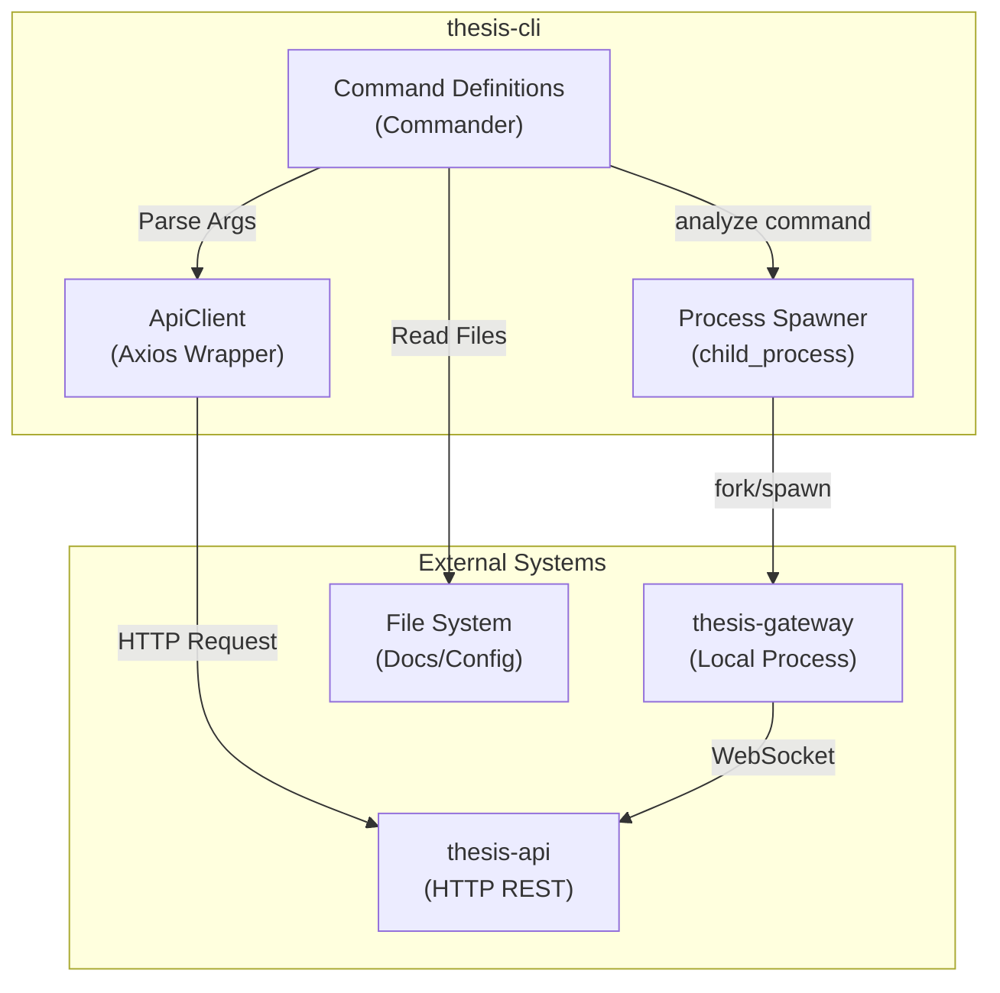
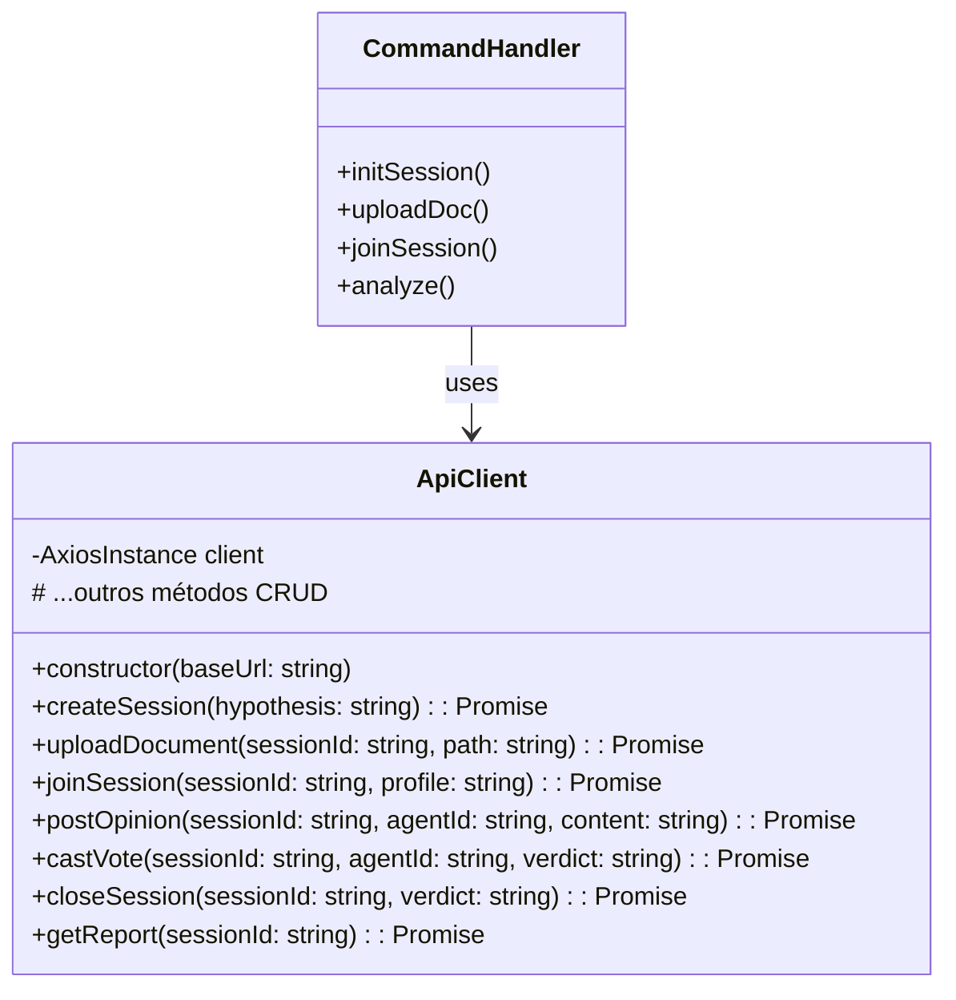
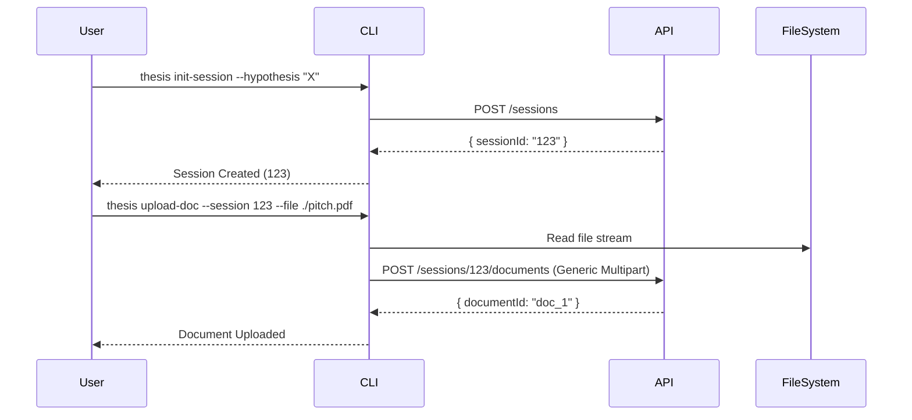
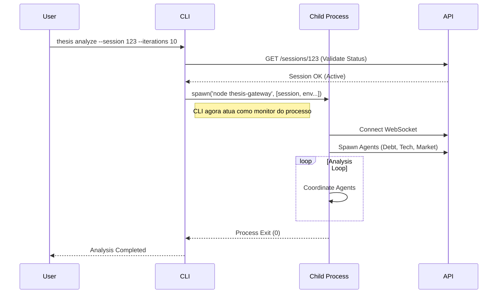
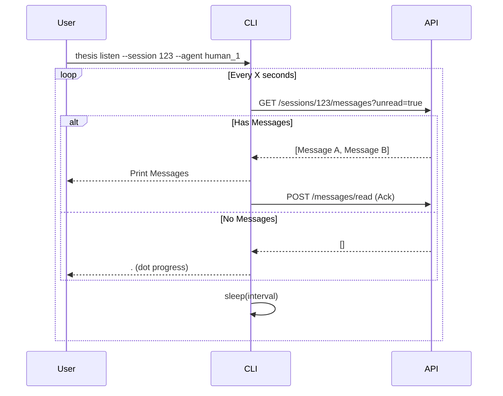

# Arquitetura - THESIS CLI

## Visão Geral

O **thesis-cli** é a interface de linha de comando primária para o ecossistema THESIS. Ele serve como o ponto de entrada principal para usuários humanos e, em alguns casos, para automações externas. Construído sobre Node.js e Commander, ele oferece uma interface robusta para interagir com a API central (`thesis-api`) e orquestrar análises locais via `thesis-gateway`.

## Diagrama de Componentes

## Estrutura do Código

A aplicação segue uma estrutura simples e direta, focada na definição de comandos e na abstração da comunicação com a API.

- **`src/index.ts`**: Ponto de entrada (Entrypoint). Define todos os comandos CLI usando `Commander.js`, valida os argumentos e invoca o `ApiClient`.
- **`src/client/api-client.ts`**: Camada de abstração para a `thesis-api`. Encapsula chamadas HTTP (Axios) e trata erros de rede, retornando tipos tipados definidos em `@thesis/protocol`.

### Class Diagram: ApiClient

## Fluxos de Execução Principais

### 1. Inicialização e Configuração de Sessão (Manual)

Este fluxo representa a interação humana padrão para preparar uma análise.

### 2. Análise Automatizada (`thesis analyze`)

Este comando é especial pois **não** apenas chama a API, mas inicia um sub-processo local que roda o `thesis-gateway`. Isso permite que o CLI atue como um "runner" portátil para análises.

### 3. Monitoramento de Mensagens (`thesis listen`)

O comando `listen` implementa um padrão de **Long Polling** (ou polling intervalado) para simular uma conexão em tempo real via terminal, permitindo que um usuário humano veja mensagens chegando para um agente específico.

## Interação com Pacotes Compartilhados

O CLI depende fortemente dos pacotes compartilhados para garantir consistência de tipos e lógica de negócios:

- **`@thesis/protocol`**:
    - Usado para tipar todas as respostas da API (`Session`, `Document`, `Agent`).
    - Garante que o CLI saiba exatamente quais campos esperar e enviar.
    - Ex: `VerdictType`, `AgentRole`.

- **`@thesis/skills`**:
    - Usado para validar inputs locais antes mesmo de chamar a API.
    - Ex: O comando `join-session` valida se o `--profile` passado existe em `AGENT_ROLES` importado de `@thesis/skills`.

## Configuração e Variáveis de Ambiente

O CLI é configurado primariamente via variáveis de ambiente, que podem ser passadas diretamente ou carregadas de um `.env` (se suportado pelo runner).

| Variável | Padrão | Descrição |
|----------|--------|-----------|
| `API_URL` | `http://localhost:4000` | URL base da `thesis-api` |
| `WS_URL` | `ws://localhost:4000` | URL WebSocket (passada para gateway no `spawn`) |
| `PI_PROVIDER` | `openai` | Provider de LLM (para `analyze`) |
| `PI_MODEL` | `gpt-4o-mini` | Modelo LLM (para `analyze`) |
| `PI_API_KEY` | - | Chave de API do provider LLM |

## Detalhes de Implementação

### Tratamento de Erros
O `ApiClient` envolve todas as chamadas Axios em blocos try-catch que normalizam os erros. Se a API retornar um erro estruturado JSON (`{ error: "message" }`), o client extrai essa mensagem e lança um `Error` limpo para ser exibido no terminal, evitando stack traces desnecessários para o usuário final, a menos que seja um crash inesperado.

### Streams e Uploads
Para o upload de documentos (`upload-doc`), o CLI utiliza `fs.createReadStream` combinado com `form-data`. Isso é crucial para permitir o upload de arquivos grandes sem carregar todo o conteúdo em memória antes do envio, mantendo a pegada de memória do CLI baixa.
