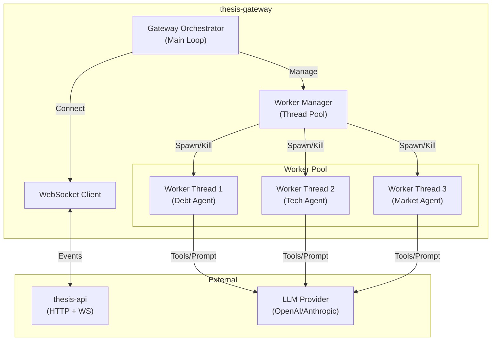
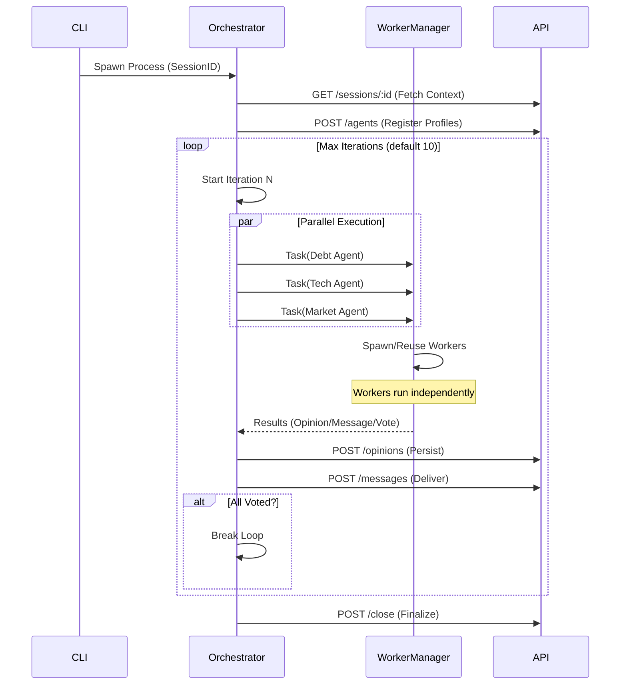

# Arquitetura - THESIS GATEWAY

## Visão Geral

O **thesis-gateway** é o orquestrador local de agentes do sistema THESIS. Ele é responsável por instanciar, gerenciar e coordenar os "Agent Workers" (processos isolados que rodam a lógica de IA) durante uma análise.

Diferente da API, que é passiva e reativa (HTTP/WS), o Gateway é ativo proativo: ele controla o "Game Loop" da análise, garantindo que os agentes operem dentro dos limites de iteração, tempo e orçamento definidos.

Designado para rodar localmente ou em containers efêmeros, ele se conecta à API central para receber o contexto e reportar resultados, mas mantém a execução pesada (LLM loops) descentralizada.

## Diagrama de Componentes

## Estrutura do Código

O Gateway é focado em concorrência e gerenciamento de estado local:

- **`src/index.ts`**: Entrypoint minimalista para o modo local. Apenas inicia `SessionRunner` com config de ambiente.
- **`src/session-runner.ts`**: Core da sessão. Contém o loop de análise e estado (`running/idle/stopped`), processa ações dos agentes e comandos humanos.
- **`src/api-gateway-client.ts`**: Cliente HTTP para API (sessão, agents, opiniões, mensagens, votos e fechamento).
- **`src/runner-state.ts`**: Máquina de transição pura para facilitar manutenção e testes (`idle`, `resume`, `vote`).
- **`src/logger.ts`**: Logging estruturado com contexto (`session`, `iter`, `action`).
- **`src/worker-manager.ts`**: Gerenciador de Worker Threads. Abstrai a criação e comunicação com `worker_threads` do Node.js. Garante que se um agente travar ou estourar o timeout, ele seja reiniciado ou encerrado sem derrubar o gateway.

## Fluxo de Execução (O Loop de Análise)

A análise acontece em "Iterações" (Turn-based system), onde todos os agentes têm a chance de agir simultaneamente.

## Componentes Chave

### 1. SessionRunner
O cérebro da operação por sessão.
- Mantém a conexão WebSocket com a API para receber eventos em tempo real (ex: "Novo documento adicionado").
- Controla a condição de parada: 
  - Limite de iterações atingido;
  - Todos os agentes votaram;
  - Timeout global.

### 2. Agent Worker Manager
Implementa um padrão de "Thread Pool" customizado.
- **Isolamento**: Cada agente roda em sua própria Worker Thread (`thesis-agent-runtime`), evitando que o bloqueio de I/O ou CPU de um afete os outros.
- **Timeout Protection**: Se um agente demorar mais que o `ITERATION_TIMEOUT`, o Manager mata a thread e reporta erro, garantindo que o sistema não trave (deadlock).

### 3. Comunicação Inter-Processos (IPC)
A comunicação entre o Orchestrator e os Workers usa o canal de mensagens nativo do Node.js:
- **Task**: Orchestrator envia contexto (histórico, novos documentos).
- **Result**: Worker retorna a ação decidida (Opinião, Voto, Mensagem).

## Integração com `thesis-agent-runtime`

O Gateway **não contém** a lógica de decisão do agente (Pi Moro loop, Prompt Engineering). Ele é apenas o "container".
Ele importa o arquivo do worker de: `apps/thesis-agent-runtime/dist/agent-worker.js`.

Isso desacopla a infraestrutura de execução (Gateway) da inteligência do agente (Runtime).

## Configuração

| Variável | Padrão | Descrição |
|----------|--------|-----------|
| `API_URL` | `http://localhost:4000` | Endpoint REST |
| `WS_URL` | `ws://localhost:4000` | Endpoint WebSocket |
| `MAX_ITERATIONS` | `10` | Ciclos máximos de análise |
| `ITERATION_TIMEOUT` | `60000` | MS limite por turno |
| `PI_PROVIDER` | `openai` | LLM Provider |
| `PI_MODEL` | `gpt-4o-mini` | Modelo LLM |

## Resilience Patterns

- **Graceful Shutdown**: Captura `SIGINT`/`SIGTERM` para encerrar workers limpos antes de sair.
- **Error Propagation**: Erros dentro dos workers são capturados e logados, mas não crishm o processo principal.
