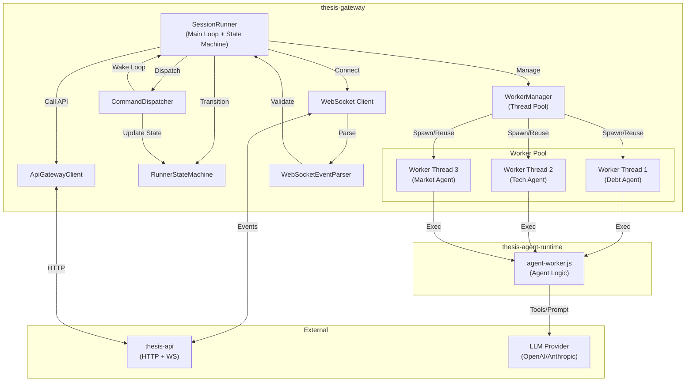
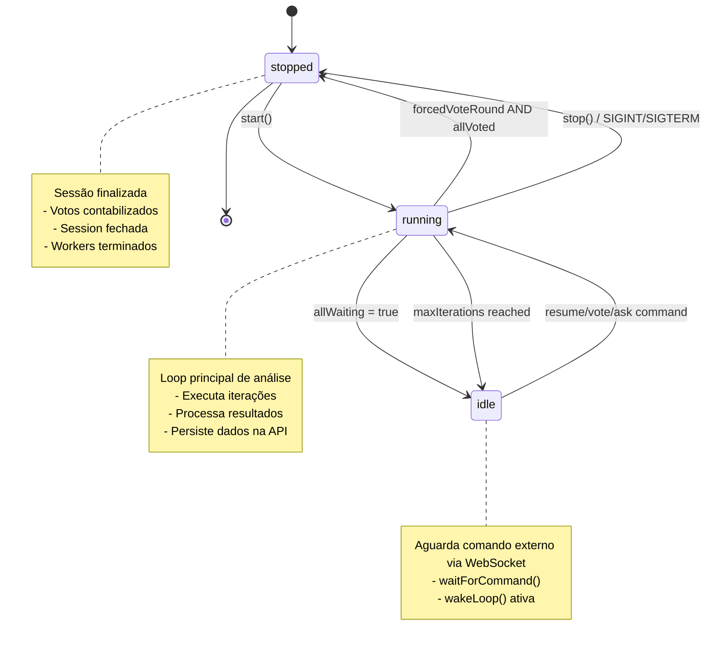
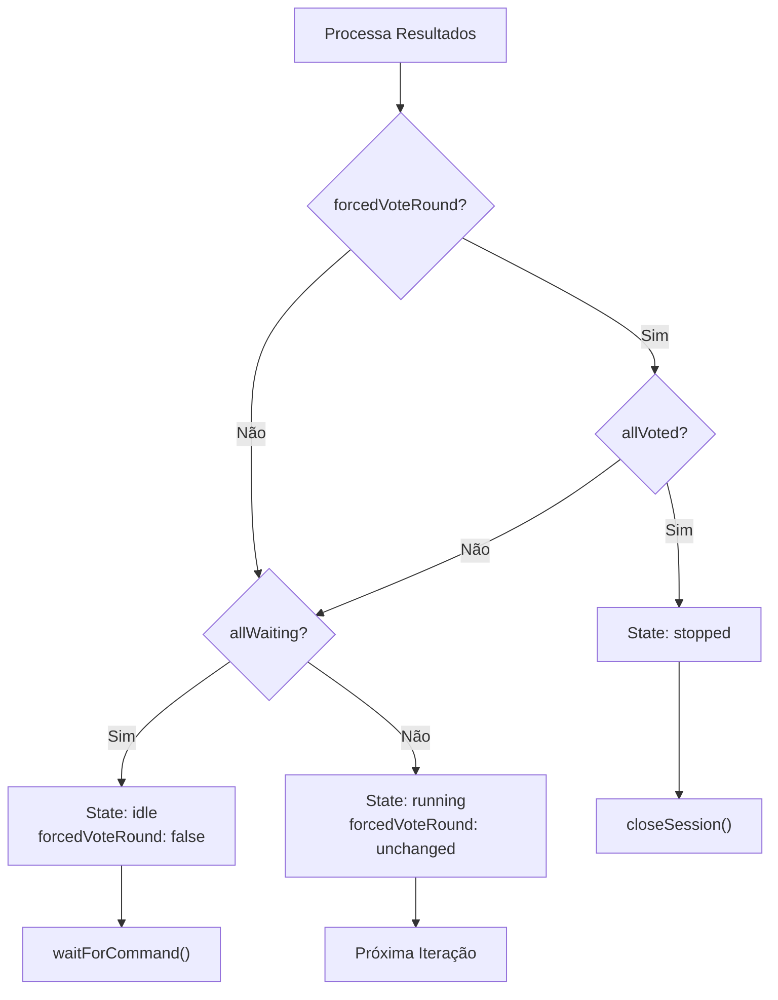
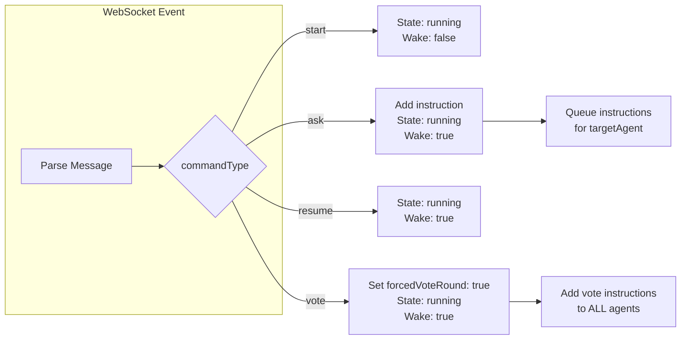
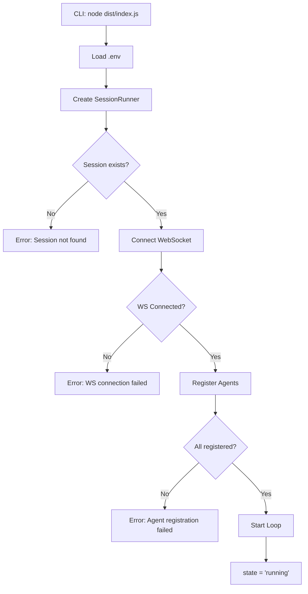
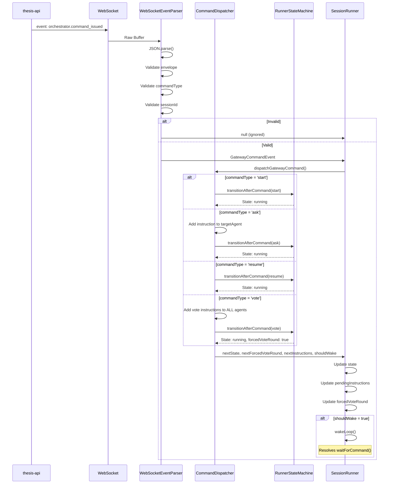
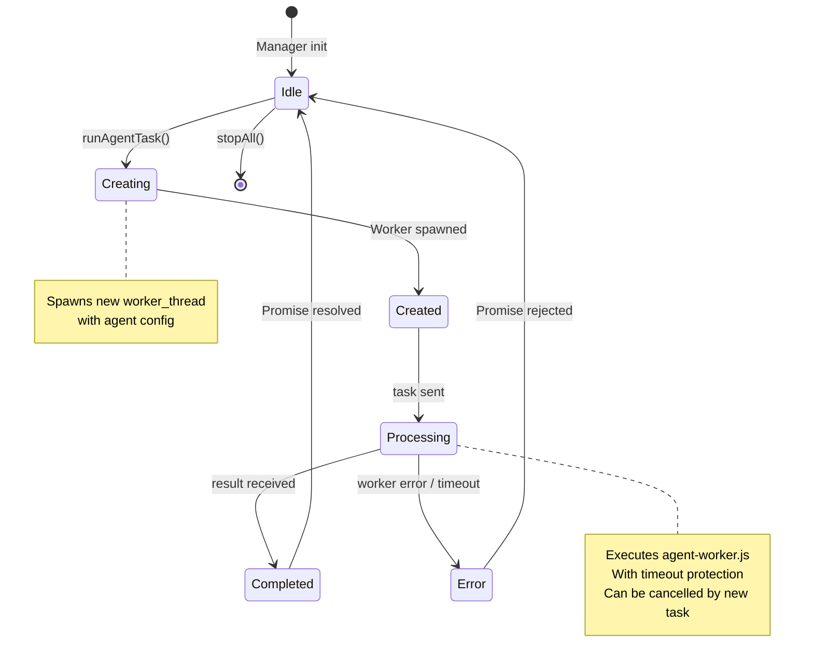
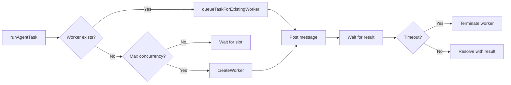

# Arquitetura - THESIS GATEWAY

## Visão Geral

O **thesis-gateway** é o orquestrador local de agentes do sistema THESIS. Ele é responsável por instanciar, gerenciar e coordenar os "Agent Workers" (processos isolados que rodam a lógica de IA) durante uma análise.

Diferente da API, que é passiva e reativa (HTTP/WS), o Gateway é ativo proativo: ele controla o "Game Loop" da análise, garantindo que os agentes operem dentro dos limites de iteração, tempo e orçamento definidos.

Designado para rodar localmente ou em containers efêmeros, ele se conecta à API central para receber o contexto e reportar resultados, mas mantém a execução pesada (LLM loops) descentralizada.

## Diagrama de Componentes



## Máquina de Estados (State Machine)

O `SessionRunner` opera em três estados principais, controlados pela máquina de transição em `runner-state.ts`:



### Regras de Transição por Iteração (`transitionAfterIteration`)



### Regras de Transição por Comando (`transitionAfterCommand`)



## Fluxo de Execução (O Loop de Análise)

```mermaid
sequenceDiagram
    participant CLI
    participant SR as SessionRunner
    participant AGC as ApiGatewayClient
    participant WS as WebSocket
    participant WM as WorkerManager
    participant AW as agent-worker
    participant LLM

    CLI->>SR: Spawn Process (SessionID)
    SR->>SR: state = 'running'
    
    SR->>AGC: GET /sessions/:id
    AGC-->>SR: Session Data
    
    SR->>AGC: POST /agents (register all)
    AGC-->>SR: Agent IDs
    
    SR->>WS: Connect ws://.../sessions/:id
    WS-->>SR: Connected

    loop Max Iterations
        SR->>SR: currentIteration += 1
        SR->>WM: Create Tasks (Debt, Tech, Market)
        
        par Parallel Execution
            WM->>AW: Run Agent Task (Debt)
            AW->>LLM: Prompt
            LLM-->>AW: Response
            AW-->>WM: Result (opinion/message/vote)
        and
            WM->>AW: Run Agent Task (Tech)
            AW->>LLM: Prompt
            LLM-->>AW: Response
            AW-->>WM: Result (opinion/message/vote)
        and
            WM->>AW: Run Agent Task (Market)
            AW->>LLM: Prompt
            LLM-->>AW: Response
            AW-->>WM: Result (opinion/message/vote)
        end
        
        WM-->>SR: All Results
        
        SR->>SR: processResults()
        
        alt Result = opinion
            SR->>AGC: POST /opinions
        else Result = message
            SR->>AGC: POST /messages
        else Result = vote
            SR->>AGC: POST /votes
            SR->>SR: votes.add(agentId)
        end
        
        SR->>SR: transitionAfterIteration()
        
        alt state = 'stopped'
            SR->>AGC: GET /votes
            AGC-->>SR: All Votes
            SR->>AGC: POST /close
            Break Loop
        else state = 'idle'
            SR->>SR: waitForCommand()
            Note over SR: Aguarda WS event
        else state = 'running'
            SR->>SR: sleep(iterationDelay)
        end
    end
    
    Note over SR,WS: WebSocket pode enviar comandos a qualquer momento
    WS->>SR: command_issued (ask/resume/vote)
    SR->>SR: dispatchGatewayCommand()
    SR->>SR: wakeLoop()
```

## Estrutura do Código

O Gateway é focado em concorrência e gerenciamento de estado local:

- **`src/index.ts`**: Entrypoint minimalista. Lê config de ambiente, instancia `SessionRunner`, configura graceful shutdown.
- **`src/session-runner.ts`**: Core da sessão. Contém:
  - Loop principal (`runLoop`) com máquina de estados
  - Estados: `running`, `idle`, `stopped`
  - Gerenciamento de votos e instruções pendentes
  - Processamento de comandos via WebSocket
- **`src/command-dispatcher.ts`**: Regras de aplicação de comandos (`ask/resume/vote`). Gerencia instruções pendentes por agente e ativa o loop.
- **`src/websocket-event-parser.ts`**: Parser/validador de eventos WS. Valida envelope e payload para evitar cast solto.
- **`src/api-gateway-client.ts`**: Cliente HTTP para API. Métodos para sessão, agentes, opiniões, mensagens, votos e fechamento.
- **`src/runner-state.ts`**: Máquina de transição pura sem efeitos colaterais:
  - `transitionAfterIteration`: Define estado após processar resultados
  - `transitionAfterCommand`: Define estado após receber comando
- **`src/types.ts`**: Definições TypeScript (RunnerState, GatewayCommandEvent, SessionData).
- **`src/logger.ts`**: Logging estruturado com contexto (`session`, `iter`, `action`).
- **`src/worker-manager.ts`**: Gerenciador de Worker Threads:
  - Thread pool com limite de concorrência
  - Timeout protection por task
  - Reutilização de workers por agente
  - IPC com `agent-worker.js`

## Fluxo de Inicialização



## Fluxo de Processamento de Comandos (WebSocket)



## Fluxo de Worker (Isolamento)



## Comandos Suportados

O Gateway recebe comandos via WebSocket através de eventos do tipo `orchestrator.command_issued`.

| Comando | Parâmetros | Ação | Transição de Estado |
|---------|------------|------|---------------------|
| `start` | - | Inicia o loop (usado internamente) | `running` |
| `ask` | `targetAgentRole`, `content` | Adiciona instrução ao agente alvo | `running`, wake loop |
| `resume` | - | Retoma o loop após idle | `running`, wake loop |
| `vote` | - | Força rodada de votação | `running`, `forcedVoteRound: true`, wake loop |

### Exemplo de Evento WebSocket

```json
{
  "type": "event",
  "data": {
    "type": "orchestrator.command_issued",
    "commandType": "ask",
    "sessionId": "uuid-123",
    "issuedBy": "user-123",
    "targetAgentRole": "debt",
    "content": "Focus on the debt covenant clause"
  }
}
```

## Componentes Chave

### 1. SessionRunner (`src/session-runner.ts`)
O cérebro da operação por sessão.

**Responsabilidades:**
- Mantém a conexão WebSocket com a API para receber comandos em tempo real
- Controla a máquina de estados (`running/idle/stopped`)
- Gerencia instruções pendentes por agente
- Coleta votos e determina quando encerrar a sessão

**Estado interno:**
```typescript
{
  state: 'running' | 'idle' | 'stopped'
  currentIteration: number
  votes: Set<string>  // agent IDs que votaram
  pendingInstructions: Map<AgentRole, string[]>  // instruções por agente
  forcedVoteRound: boolean
}
```

**Condições de parada:**
- Limite de iterações atingido (`maxIterations`)
- Todos os agentes votaram E `forcedVoteRound = true`
- Timeout global (via `iterationTimeout` por task)

### 2. Worker Manager (`src/worker-manager.ts`)
Implementa um padrão de "Thread Pool" customizado com reutilização.

**Características:**
- **Isolamento**: Cada agente roda em sua própria Worker Thread (`thesis-agent-runtime`)
- **Reutilização**: Workers são mantidos vivos por agente entre iterações
- **Timeout Protection**: Se um agente demorar mais que `iterationTimeout`, a thread é terminada
- **Concorrência controlada**: Limite máximo de workers simultâneos

**Fluxo de task:**


### 3. Command Dispatcher (`src/command-dispatcher.ts`)
Aplica as regras de negócio para cada tipo de comando.

**Lógica:**
- `start`: Apenas retorna estado atual (usado internamente)
- `ask`: Adiciona instrução ao `pendingInstructions` do agente alvo
- `resume`: Apenas ativa o loop
- `vote`: Adiciona instruções de votação a **TODOS** os agentes + ativa `forcedVoteRound`

**Efeitos:**
- Atualiza `nextState` via `transitionAfterCommand`
- Atualiza `nextForcedVoteRound`
- Acumula instruções em `nextInstructions` (imutável)
- Determina se deve ativar o loop (`shouldWake`)

### 4. Runner State Machine (`src/runner-state.ts`)
Máquina de estados pura, sem efeitos colaterais, facilitando testes.

**Funções:**

`transitionAfterIteration(input)`
- Se `forcedVoteRound = true` E `allVoted = true` → `stopped`
- Se `allWaiting = true` → `idle`
- Caso contrário → `running` (mantém `forcedVoteRound`)

`transitionAfterCommand(input)`
- Se `commandType = vote` → `forcedVoteRound = true`
- Caso contrário → mantém `forcedVoteRound`
- Sempre retorna `running`

### 5. API Gateway Client (`src/api-gateway-client.ts`)
Cliente HTTP para comunicação com `thesis-api`.

**Endpoints:**
- `GET /sessions/:id` - Busca contexto da sessão
- `POST /sessions/:id/agents` - Registra agente
- `POST /sessions/:id/opinions` - Persiste opinião
- `POST /sessions/:id/messages` - Envia mensagem inter-agente
- `POST /sessions/:id/votes` - Registra voto
- `GET /sessions/:id/votes` - Lista votos
- `POST /sessions/:id/close` - Finaliza sessão

### 6. WebSocket Event Parser (`src/websocket-event-parser.ts`)
Valida e parser mensagens WebSocket.

**Validações:**
- Parse JSON com try/catch
- Verifica envelope `{type: 'event', data: {type: 'orchestrator.command_issued'}}`
- Valida `commandType` contra `GATEWAY_COMMAND_TYPES`
- Valida `sessionId` e `issuedBy` (strings não vazias)
- Valida `targetAgentRole` (opcional, string se presente)
- Valida `content` (opcional, string se presente)

**Retorno:** `GatewayCommandEvent | null`

## Integração com `thesis-agent-runtime`

O Gateway **não contém** a lógica de decisão do agente (Pi Moro loop, Prompt Engineering). Ele é apenas o "container".
Ele importa o arquivo do worker de: `apps/thesis-agent-runtime/dist/agent-worker.js`.

**Comunicação IPC:**

**Task → Worker:**
```typescript
{
  session_id: string
  agent_id: string
  profile_role: AgentRole
  skill_path: string  // Caminho para skill no @thesis/skills
  skill_content: string
  iteration: number
  max_iterations: number
  api_url: string
  ws_url: string
  pi_provider: string
  pi_model: string
  iteration_timeout_ms: number
  forced_vote?: boolean
  human_instructions?: string[]
}
```

**Result ← Worker:**
```typescript
{
  agent_id: string
  iteration: number
  action: 'opinion' | 'message' | 'vote' | 'wait' | 'search'
  content?: string
  confidence?: number
  target_agent?: AgentRole
  verdict?: 'approve' | 'reject' | 'abstain'
  wait_seconds?: number
  reasoning?: string
}
```

Isso desacopla a infraestrutura de execução (Gateway) da inteligência do agente (Runtime).

## Configuração

| Variável | Padrão | Descrição |
|----------|--------|-----------|
| `API_URL` | `http://localhost:4000` | Endpoint REST |
| `WS_URL` | `ws://localhost:4000` | Endpoint WebSocket |
| `MAX_ITERATIONS` | `10` | Ciclos máximos de análise |
| `ITERATION_TIMEOUT` | `60000` | MS limite por task de agente |
| `ITERATION_DELAY` | `2000` | MS de delay entre iterações |
| `PI_PROVIDER` | `openai` | LLM Provider |
| `PI_MODEL` | `gpt-4o-mini` | Modelo LLM |

## Resilience Patterns

- **Graceful Shutdown**: Captura `SIGINT`/`SIGTERM` para encerrar workers limpos antes de sair.
- **Error Propagation**: Erros dentro dos workers são capturados e logados, mas não crasham o processo principal.
- **Timeout Protection**: Tasks com mais de `iterationTimeout_ms` são automaticamente terminadas.
- **Worker Reuse**: Workers são mantidos vivos por agente entre iterações para reduzir overhead.
- **State Isolation**: Máquina de estados pura (`runner-state.ts`) facilita testes e manutenção.
