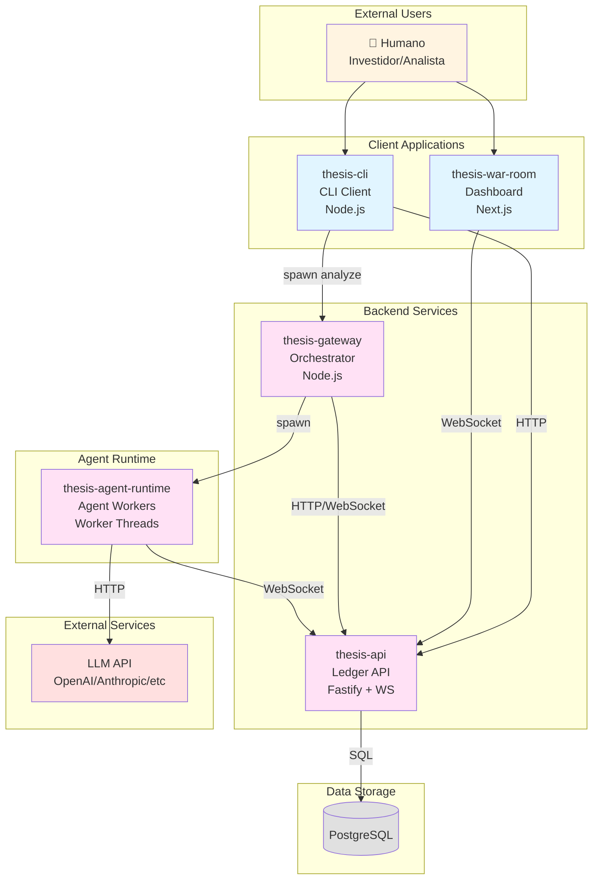
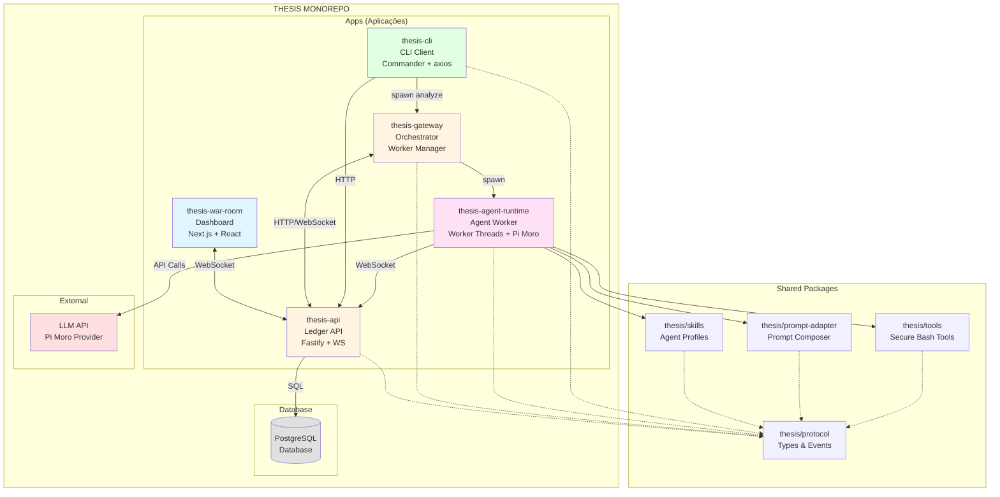
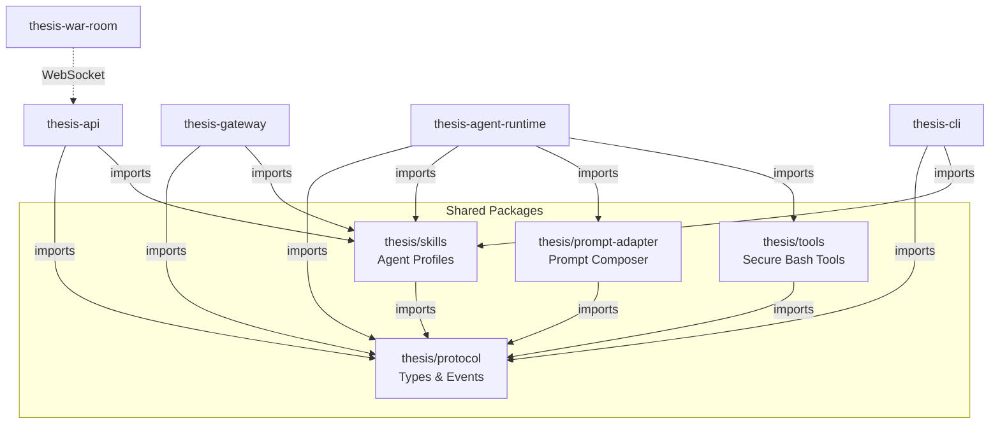
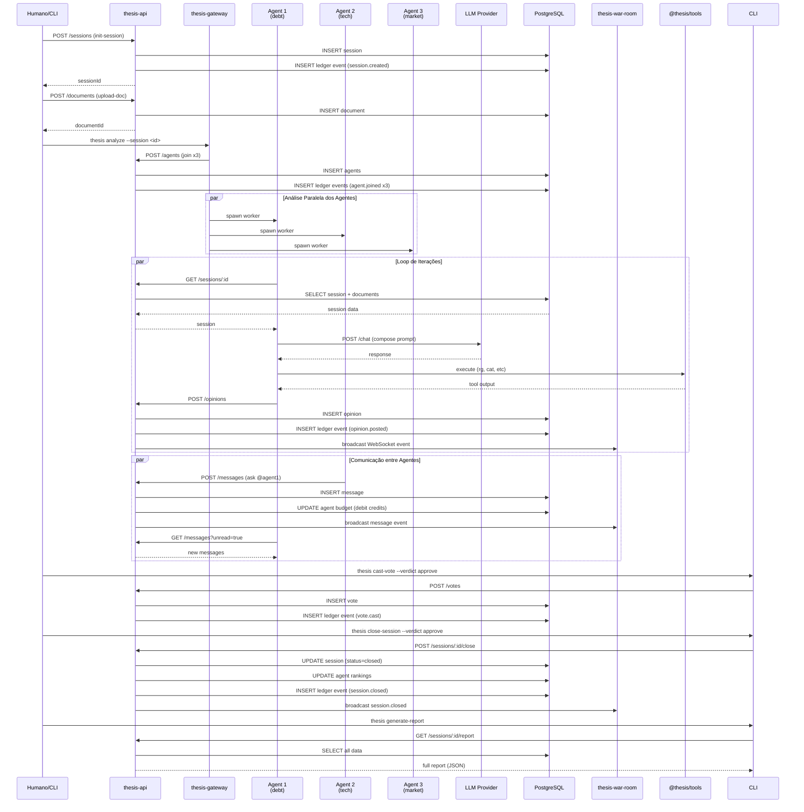
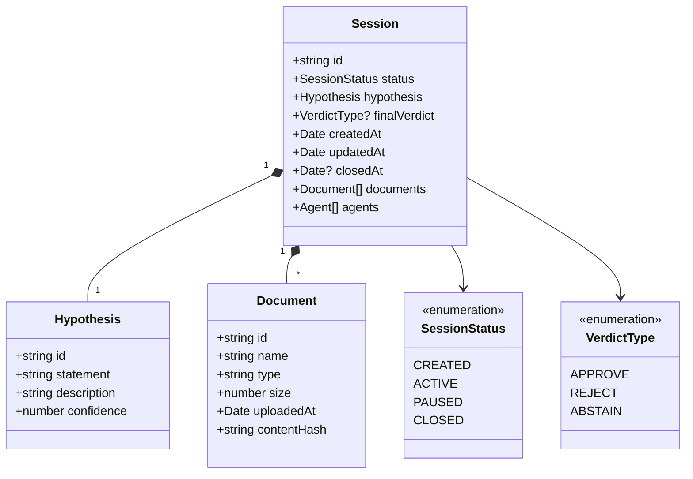
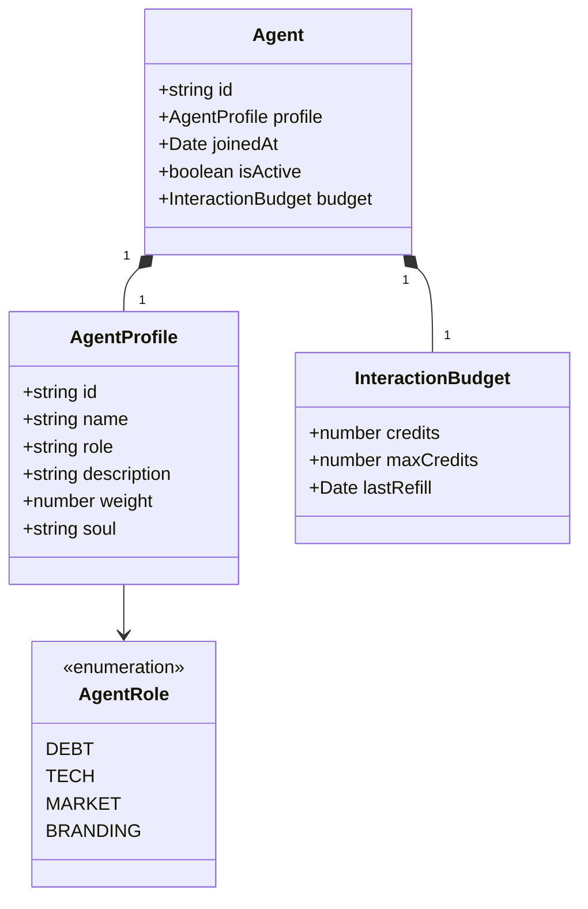

# Arquitetura Geral - THESIS

## Visão Geral

THESIS (The Council) é uma plataforma de análise de VC orientada por múltiplos agentes, com debate estruturado, orçamento de interação e veredito final auditável. O sistema segue uma arquitetura em camadas com separação clara de responsabilidades entre aplicações e pacotes compartilhados.

## Diagrama de Arquitetura (Nível de Containers)



## Diagrama de Componentes Detalhado



## Dependências entre Packages



## Aplicações (apps/)

### 1. thesis-api
**Porta:** 4000  
**Tecnologia:** Fastify + WebSocket + PostgreSQL

**Propósito:** API central que gerencia o ledger (livro-razão) da análise. É a fonte de verdade para todo o estado das sessões.

**Responsabilidades:**
- CRUD de sessões, hipóteses, documentos
- Gerenciamento de agentes e perfis
- Armazenamento de opiniões, votos, mensagens
- Ledger de eventos para auditoria completa
- WebSocket para tempo real (broadcast de eventos)
- Upload/download de documentos
- Relatórios e ranking de agentes

**Dependências:**
- `@thesis/protocol` - Tipos compartilhados
- `@thesis/skills` - Perfis de agentes pré-definidos
- `@fastify/websocket` - Comunicação em tempo real
- `pg` - Cliente PostgreSQL

---

### 2. thesis-gateway
**Tecnologia:** Node.js + WebSocket

**Propósito:** Orquestrador de múltiplos agentes. Gerencia o ciclo de vida dos workers de agentes e coordena sua comunicação com o sistema.

**Responsabilidades:**
- Spawn e gerenciamento de workers de agentes
- Balanceamento de carga entre agentes
- Coleta e agregação de resultados
- Respeito a limites de iteração e timeout
- Integração com API para controle da análise

**Dependências:**
- `@thesis/protocol` - Tipos compartilhados
- `@thesis/skills` - Configuração de perfis
- `ws` - Cliente WebSocket

---

### 3. thesis-agent-runtime
**Tecnologia:** Worker Threads + Pi Moro (@mariozechner/pi-agent-core)

**Propósito:** Runtime de execução individual de um agente. Cada agente roda em um worker separado e implementa o loop de decisão do Pi Moro.

**Responsabilidades:**
- Loop de decisão do Pi Moro
- Composição de prompts via Prompt Adapter
- Execução de ferramentas via @thesis/tools
- Publicação de opiniões na API
- Escuta e resposta a mensagens de outros agentes
- Gerenciamento de budget de interação
- Coleta de fatos para memória de longo prazo

**Dependências:**
- `@thesis/protocol` - Tipos de eventos/comandos
- `@thesis/skills` - Skills e perfis carregáveis
- `@thesis/prompt-adapter` - Composição de prompts
- `@thesis/tools` - Execução segura de comandos
- `@mariozechner/pi-agent-core` - Core do Pi Moro

---

### 4. thesis-cli
**Tecnologia:** Commander + axios

**Propósito:** Interface de linha de comando para operar o sistema. Usado tanto por humanos quanto por agentes externos.

**Responsabilidades:**
- `init-session` - Criar nova sessão de análise
- `upload-doc` - Subir documentos
- `join-session` - Entrar com perfil de agente
- `post-opinion` - Publicar opinião
- `ask` - Enviar mensagem para outro agente
- `listen` - Escutar mensagens (polling)
- `cast-vote` - Votar na sessão
- `close-session` - Encerrar com veredito
- `generate-report` - Gerar relatório JSON
- `analyze` - Executar análise completa

**Dependências:**
- `@thesis/protocol` - Tipos de requisições/respostas
- `@thesis/skills` - Lista de perfis disponíveis
- `thesis-gateway` - Para executar análise automática (comando `analyze`)

---

### 5. thesis-war-room
**Porta:** 3000  
**Tecnologia:** Next.js + React + Tailwind + Radix UI + Framer Motion

**Propósito:** Dashboard interativo em tempo real para monitoramento e análise de sessões de análise de VC.

**Responsabilidades:**
- Activity feed global com timeline de eventos de todas as sessões
- Visualização detalhada de agentes com identidade cards e badges de atividade
- Feed social com opiniões, mensagens, votos e documentos
- Filtros por tipo de agente (debt, tech, market, branding) e tipo de atividade
- Heatmap de atividade temporal para análise de padrões
- Gráficos e métricas com visualização de dados (recharts)
- Interface de voto interativa com dialog de confirmação
- Layout responsivo com grid bento para dashboards flexíveis
- Animações suaves e transições de página (framer-motion)
- Conexão WebSocket para atualizações em tempo real
- Estados de loading e empty states para melhor UX

**Dependências:**
- `next` - Framework React
- `react` / `react-dom` - Biblioteca React
- `lucide-react` - Ícones
- `recharts` - Gráficos e visualizações de dados
- `framer-motion` - Animações e transições
- `@radix-ui/*` - Componentes UI acessíveis (Dialog, DropdownMenu, Select, Tabs)
- `clsx` - Utilitário para classes condicionais
- `tailwind-merge` - Merge inteligente de classes Tailwind

---

## Pacotes Compartilhados (packages/)

### @thesis/protocol
**Propósito:** Contratos compartilhados de tipos, eventos e comandos. É a "lingua franca" entre todas as aplicações.

**Conteúdo:**
- `Session`, `Hypothesis`, `Document`, `Agent`
- `Opinion`, `Vote`, `Message`
- `LedgerEvent`, `EventType`, `CommandType`
- Enums: `SessionStatus`, `VerdictType`, `AgentRole`

**Por que existe:** Garante consistência de tipos em toda a base. Se um evento muda, todos os consumidores são notificados via TypeScript.

---

### @thesis/skills
**Propósito:** Definição de perfis de agentes e habilidades (skills) carregáveis.

**Conteúdo:**
- `AGENTS_CONFIG` - Configuração de perfis (debt, tech, market, branding)
- `AGENT_ROLES` - Lista de roles disponíveis
- `SkillsLoader` - Parser de arquivos markdown de skills
- Perfis pré-definidos com pesos e SOULs específicos

**Por que existe:** Permite que agentes especializados sejam facilmente criados e configurados sem modificar o core do sistema.

---

### @thesis/prompt-adapter
**Propósito:** Composição de prompts complexos para o LLM, seguindo o padrão SOUL.

**Ordem de Composição:**
1. `base_system` - Sistema base do Pi Moro
2. `SOUL.md` global - Valores globais do THESIS
3. `profile soul` - Valores específicos do perfil (ex: debt-focused)
4. `skills ativas` - Skills carregadas para o contexto
5. `runtime constraints` - Budget, política de tools, regras da sessão

**Por que existe:** Centraliza toda a lógica de prompt engineering e garante auditoria (snapshot do prompt final é salvo no ledger).

---

### @thesis/tools
**Propósito:** Registro e execução segura de ferramentas bash com allowlist.

**Ferramentas Padrão:**
- `ls` - Listar diretórios
- `cat` - Ler arquivos
- `rg` - Buscar conteúdo (ripgrep)
- `wc` - Contar linhas/palavras/bytes
- `head`/`tail` - Início/fim de arquivos
- `jq` - Processar JSON

**Características:**
- Allowlist configurável por sessão/agente
- Timeout por execução
- Limite de output em bytes
- Log completo no ledger

**Por que existe:** Fornece capacidades de investigação seguras para os agentes, sem dar acesso irrestrito ao sistema.

---

## Fluxo de Análise Completa



## Padrão de Comunicação

### Event-Driven via Ledger
Toda ação no sistema gera um evento no ledger:

```typescript
// Exemplo de eventos
interface OpinionPostedEvent {
  type: 'opinion.posted';
  sessionId: string;
  agentId: string;
  opinionId: string;
  content: string;
  confidence: number;
  timestamp: Date;
}

interface SessionClosedEvent {
  type: 'session.closed';
  sessionId: string;
  finalVerdict: 'approve' | 'reject';
  timestamp: Date;
}
```

### WebSocket Broadcast
- API → War Room: Todos os eventos são broadcastados para clientes conectados
- API → Agent Runtime: Agentes escutam eventos relevantes para reagir

### REST API
- CLI → API: Comandos síncronos para operações CRUD
- Agent Runtime → API: POST de opiniões, votes, mensagens

---

## Estrutura de Dados

### Session


### Agent


## Princípios Arquiteturais

1. **Separação de Concerns:** Cada app tem responsabilidade única
2. **Tipo-First:** Protocolo define todos os tipos compartilhados
3. **Event Sourcing:** Ledger é fonte de verdade para histórico
4. **Isolation:** Cada agente roda em worker isolado
5. **Minimal Tools:** Só adiciona ferramentas quando necessário
6. **Phase-Based:** Evolução incremental por fases (Fase 0-7)
